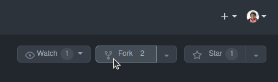

# Whack-A-Marmot


[View the live project here.](https://halfpintutopia.github.io/magic-forest-trail/)

[//]: # (TODO Description)


---

## Table of contents
* [User Experience](#user-experience--ux-)
  * [Intended Audience](#intended-audience)
  * [User Stories](#user-stories)

* [Design](#design)
  * [Wireframes](#wireframes)
  * [Colour Scheme](#colour-scheme)
  * [Typography](#typography)
  * [Imagery](#imagery)

* [Features](#features)
  * [General Features on Each Page](#general-features-on-each-page)
  * [Future Implementations](#future-implementations)
  * [Accessibility](#accessibility)

* [Technologies Used](#technologies-used)
  * [Languages Used](#languages-used)
  * [Frameworks, Libraries & Programs Used](#frameworks-libraries-and-programs-used)

* [Remote & Local Development](#remote-and-local-deployment)
  * [Remote Deployment](#remote-deployment)
  * [Local Deployment](#local-deployment)
    * [How to Fork](#how-to-fork)
    * [How to Clone](#how-to-clone)

* [Testing](#testing)

* [Credits](#credits)
  * [Code Used](#code-used)
  * [Content](#content)
  * [Media](#media)
  * [Acknowledgments](#acknowledgements)

---

# User Experience (UX)

The site was designed and developed mobile first. 

Marmots in the spring up in the Swiss Alps were the inspiration for this game. The idea was to provide a colourful, visually appealing and stimulating game The colours were chosen to represent spring. 

## Intended Audience

* Adults
* Children

* ## User stories

* Client Goals
    * Provide an online that test and improve:
      * motor skills
      * accuracy
      * concentration
      * hand and eye coordination
* First Time Visitor Goals
    * Choose the settings
      * dark or light mode
      * easy or hard play mode
    * Read the game instructions
    * Play the game
    * Beat your previous score
* Return Visitor Goals
    * Improve scores
* Frequent Visitor Goals
    * Compete with other players


# Design

## Wireframes
Wireframes were created for the site with [Figma](https://www.figma.com).


*Wireframe for mobile and desktop*

<details>
<summary>Game page for mobile and desktop</summary>
<br>


*Start page - mobile and desktop*
</details>
<br>

<details>
<summary>Instructions modal for mobile and desktop</summary>
<br>


*Instructions modal - mobile and desktop*
</details>
<br>

<details>
<summary>Settings modal for mobile and desktop</summary>
<br>


*Settings modal - mobile and desktop*
</details>
<br>

To see the full wireframe, view it [here](https://www.figma.com/file/uxe1pvEmLdY4evLEZttrqL/Whack-A-Marmot-(Copy)?t=gLTwq7qkJGoX6F3p-1).

An additional note regarding the original images for the wireframe. The initial plan was to use SVG hills, and calculate percentage of the length to get the `x` and `y` coordinates, and calculating the slope for the angle of each marmot. This is to be added as a future implementation. 

---

The website consists of the following:

* Start page
* Play page
* A 404 page
* Instructions modal
* Settings modal
* Scoreboard

## Colour Scheme

[//]: # (TODO Description why color palette was chosen)

Created colour palette using:
* [Adobe Color](https://color.adobe.com/create/image) 


### Accessibility Concerns

The colour palette was altered to improve accessibility and increase contrast.

Accessibility tested using the Adobe's [Accessibility Tools](https://color.adobe.com/create/color-contrast-analyzer).

Results and contrast improvements suggestions:

<details>
<summary>Dark purple & Pale blue</summary>
<br>


*Settings modal - mobile and desktop*
</details>
<br>

Feedback from lighthouse testing raised an issue with accessibility and colour contrast. As a result, the red colour was changed on the button with white font. 

## Typography

Bangers and Oswald Fonts were chosen from [Google Fonts](https://fonts.google.com). Fonts were selected to represent fun, playful, clear and easy to read.


<br>

### References for typography:

When thinking about typography, the type had to suit responsively as well. The fonts had to be also readable on mobile View.

Using Utopia, clamps for fonts and spaces were created. This minimised errors, stopping the fonts from getting bigger at a certain view width and height, or too small, dependent on device view ports.

* [min(), max(), and clamp(): three logical CSS functions to use today](https://web.dev/min-max-clamp/)
* [Modern Fluid Typography Using CSS Clamp](https://www.smashingmagazine.com/2022/01/modern-fluid-typography-css-clamp/)
* [RFS](https://github.com/twbs/rfs#installation)
* [Utopia - Responsive font and space sizing](https://utopia.fyi)

## Imagery

Images are located on all pages. At the top of the page, under the navigation, is the header image. All pages have the same thematic layout, and the layout should be consistent on all pages, including the home page. 

All images used were downloaded from:

* [Adobe Stock](https://stock.adobe.com)

Images match the theme of spring and outdoorsy.

To increase the speed of the website., all images were compressed. Also, I added the ```lazy-loading``` attribute to images showing below the fold.

### References for images

* [An image format for the Web](https://developers.google.com/speed/webp)
* [A Guide to Responsive Images with Ready-to-Use Templates](https://medium.com/free-code-camp/a-guide-to-responsive-images-with-ready-to-use-templates-c400bd65c433)
  * A copy of the files to create .webp extension images are to be found [here](docs/responsive-images).
<br>

Icons were used for social links and buttons. The icons used on the site were taken from:

* [Font Awesome](https://fontawesome.com/)

<br>

# Features

Details of each feature are listed under [General Features on Each Page](#general-features-on-each-page).

The website consists of the following features:
* Game page
* Play page
* A 404 page
* Instructions modal
* Settings modal

---

[Start page](https://halfpintutopia.github.io/whack-a-marmot/)

The start page consists of the following sections. 
* Title
* Three buttons
  * Play
  * Instructions
  * Settings

--- 

Play page

The play page consists of the following:
* Image banner at the top of the page
* Multiple images, title and text, alternatively reversing the order

---

Modals for Instructions & Settings

The instructions modal differs slightly from the settings modal, as it contains:
* A carousel
  * Slider for each page of the instructions

---

Every page except the 404 page, success page and form page has a CTA Button, which is a button to take visitors to the booking form.

## General Features on Each Page 

### Specific features

#### Trail List


*Screenshot of the trail (lists) feature for mobile*

<br>


*Screenshot of the trail (lists) feature for desktop*

<br>

The trail cards displayed contain text descriptions. The height of each card depends on the size of the device. A class was added to shorten the text so that the card heights were manageable on mobile devices. 

#### Gallery


*Screenshot of the gallery feature for mobile*

<br>


*Screenshot of the gallery feature for desktop*

<br>

The gallery is in a grid layout masonry style. The gallery was to suit and demonstrate images that are meant to be viewed in portrait or landscape.

<br>

There are two versions of the text-image feature. 

The first one can be found on the home page. This is a simple layout of a single image and text. When multiple image text sections are on the same page, they are set to be alternative sides. The text remains in a container, and the Image stretches to either the left or right side, dependent on which side of the text it is positioned. This effect was to fill empty space on wider devices and to add colour.

The second version is seen on the storybook page. The layout is exactly the same. The content is slightly different, as, under each text, there is a link which enables the visitor to quickly go to the trail page if they are interested in visiting the place mentioned in the story. 

## Future Implementations

1. Add random username generator
2. Change the scoreboard to a leaderboard
3. Vary speeds with more settings variables
4. Implement more animation
5. Be more precise, differentiate between double click and first clicks
6. Use SVG hills for marmots to pop up from behind
7. Add missed hits

## Accessibility

* Use of semantic HTML
* Use of ARIA
* Use of alt attributes
* Use Adobe Color to check colour contrast

# Technologies Used

## Languages Used

* HTML5
* CSS3
* JavaScript

## Frameworks, Libraries and Programs Used

* [Google Fonts](https://fonts.google.com)
    * Google Fonts was used to import the font to the style.css, which is used on all pages throughout the project.
* [Font Awesome](https://fontawesome.com/)
    * Font Awesome was used on all necessary pages throughout the website to add icons for aesthetic and UX purposes.
* [Git](https://git-scm.com/)
    * Git was used for version control by utilising the Gitpod terminal to commit to Git and push to GitHub.
* [GitHub](https://github.com/)
    * GitHub was used to store the project's code after being pushed from Git.
* [Gitpod](https://www.gitpod.io/)
* [Coolors](https://coolors.co/)
* [Adobe Color](https://color.adobe.com/create/color-wheel)
* [Adobe Stock](https://stock.adobe.com)
* [Adobe Illustrator](https://www.adobe.com/ch_de/products/illustrator.html)
* [Figma](https://www.figma.com/)
* [Inkscape](https://inkscape.org/)
* [GIMP](https://www.gimp.org/)
* Devtool
    * [Firefox](https://firefox-source-docs.mozilla.org/devtools-user/)
    * [Chrome](https://developer.chrome.com/docs/devtools/)

# Remote and Local Deployment

Git was used for version control. Version control was done locally and remotely. For remote version control, GitHub was used. Regular commits were made after each file change.

## Remote deployment
GitHub Pages was used to deploy the site remotely. 

https://user-images.githubusercontent.com/30613818/205482822-4c33545b-8b52-4a2b-9212-0e119214ff22.mov

*Screencast of deployment*

<br>

1. Go to the repository
2. Click the Settings tab
3. Click on Pages in the left-hand menu, under code and automation

   *Screenshot of how to get the Pages section*

4. Under Build and deployment > Source, ensure Deploy from a branch is selected 

   *Screenshot of source option*

5. Under Build and deployment > Branch, select the main branch 

   *Screenshot of branch option*

6. Click save
7. It may take more than a few minutes, but when the page has been created, you will see the following success message 

   *Screenshot of success message*


## Local Deployment

To contribute or check the code yourself, you can:
* fork the repository
* clone the repository

### How to Fork

1. To fork, go the repository
2. Click on the Fork button in the top left corner of the page. 
3. Fill in the form with either keep the name or create a new name for the repository 


### How to Clone

1. To clone on the repository 
2. Click on the Code button above the repository files. 
3. A drop-down will appear and choose either 
: 
    * HTTP
    * SSH
    * GitHub CLI 
4. Go to your terminal and decide where you want to clone the files.
5. Use the copy/paste button and copy it into your terminal
6. You also have the option to download a ZIP file of the code

# Testing

The devices selected were:
* Ubuntu
    * Firefox 108 on Ubuntu 22.04.1 LTS
    * Chromium Version 109.0.5414.119 on Ubuntu 22.04.1 LTS
* Mac
    * Safari 16 on macOS Ventura
    * Chrome on macOS Ventura
* Android
    * Chrome Mi Max 3
    * Chrome Xiaomi Mi 9SE

## User experience

Testing implemented from [User stories](#user-stories)

### Client Goals Testing

| Client goal                                                                                               | Implementation | Tested | Successful |
|-----------------------------------------------------------------------------------------------------------|:--------------:|:------:|:----------:|
| Provide an online that test and improve: motor skills, accuracy, concentration, hand and eye coordination |      Yes       |  Yes   |

### First-Time Visitor Goals

| First Time Visitor Goals   |                                         Implementation                                         | Tested | Successful |
|----------------------------|:----------------------------------------------------------------------------------------------:|:------:|:----------:|
| Choose the settings        |          Settings available for to choose between dark and light, easy and difficult           |  Yes   |    Yes     |
| Read the game instructions |                               Instructions provided in a modal.                                |  Yes   |    Yes     |
| Play the game              | Start game play, by clicking button. Also users can exit with the exit button on the top right |  Yes   |    Yes     |
| Beat previous score        |                                Check scoreboard to beat score.                                 |  Yes   |    Yes     |

### Return Visitor Goals

| Return Visitor Goals |                           Implementation                            | Tested | Successful |
|----------------------|:-------------------------------------------------------------------:|:------:|:----------:|
| Improve scores       | Return to game to see the scoreboard again (stored in localStorage) |  Yes   |    Yes     |


### Frequent Visitor Goals

| Frequent Visitor Goals           |        Implementation        | Tested | Successful |
|----------------------------------|:----------------------------:|:------:|:----------:|
| Other players can add a username | Compare scores in scoreboard |  Yes   |    Yes     |

### Bugs and fixes

| Bug / Errors                            | Where / Location site | Browser | Device      | Remarks                                                                                                                                                                                  | Mode (light / dark) | Fixed | Solution                                                               |
|-----------------------------------------|-----------------------|---------|-------------|------------------------------------------------------------------------------------------------------------------------------------------------------------------------------------------|---------------------|-------|------------------------------------------------------------------------|
| Left clicking on first instruction page | Instructions          | Firefox | PC          | When clicking left arrow once on first page, user has to right click twice to get to second page. clicking left arrow twice, clicking right arrow three times to get to second page etc. |                     | No    | Specific device or browser issue. Not able to replicate.               |
| Hitting the marmot                      | Play                  | Firefox | PC          | When holding left mouse button down upon whacking marmot, user drags marmot image away                                                                                                   |                     | Yes   | Set "draggable" attribute                                              |
| Top left marmot                         | Play                  | Firefox | PC          | Body of top left marmot looks cut off. Only head is visible                                                                                                                              |                     | No    | Not a big issue, so not taken as a priority                            |
| Refreshing page                         | Play                  | Firefox | PC          | When refreshing page, game cannot be reset. Previous player name is saved and game cannot be restarted                                                                                   |                     | Yes   | Remove function of setting marmot holes on resize.                     |
| Dark Mode                               | Settings              | Firefox | PC          | Changing to dark mode does not work                                                                                                                                                      |                     | Yes   | Fix settings error                                                     |
| Difficulty                              | Settings              | Firefox | PC          | Changing difficulty does not work                                                                                                                                                        |                     | Yes   | Fix settings error                                                     |
| See the marmot                          | Instructions          | Chrome  | Xiaomi 9 SE | The line "See the marmot" is cut off / not visible                                                                                                                                       |                     | Yes   | Make written instructions hidden in mobile                             |
| Whack the marmot                        | Instructions          | Chrome  | Xiaomi 9 SE | "Marmot" is cut off                                                                                                                                                                      |                     | Yes   | Make written instructions hidden in mobile                             |
| How many marmots can you whack          | Instructions          | Chrome  | Xiaomi 9 SE | "Marmots can you whack" is cut off                                                                                                                                                       |                     | Yes   | Make written instructions hidden in mobile                             |
| Dark Mode                               | Settings              | Chrome  | Xiaomi 9 SE | Changing to dark mode does not work                                                                                                                                                      |                     | Yes   | Fix settings error                                                     |
| Difficulty                              | Settings              | Chrome  | Xiaomi 9 SE | Changing difficulty does not work                                                                                                                                                        |                     | Yes   | Fix settings error                                                     |
| Buttons                                 | Settings              | Chrome  | Xiaomi 9 SE | Black buttons move too far to the right when clicking them                                                                                                                               |                     | Yes   | Change container size on modal                                         |
| Marmots overlay                         | Home                  | Chrome  | Xiaomi 9 SE | In some cases the 6 marmots are displayed all over the menu screen. no clue why or how                                                                                                   |                     | Yes   | Remove function to redraw marmot holes on resize.                      |
| Game start                              | Play                  | Chrome  | Xiaomi 9 SE | Upon game start user has to scroll down a bit. Basically as long as the top line with the URL is high                                                                                    |                     | Yes   | Add overflow hidden                                                    |
| Top left marmot                         | Play                  | Chrome  | Xiaomi 9 SE | Same as above. no neck, no body                                                                                                                                                          |                     | No    | Not a big issue, so not taken as a priority                            |
| Multiple hits                           | Play                  | Chrome  | Xiaomi 9 SE | It is possible to repeatedly hit the active marmot more than once. Kill count stacks                                                                                                     |                     | Yes   | Add removeEventListener after score is increased                       |
| Marmot hits                             | Play                  | Chrome  | Xiaomi 9 SE | In some cases the animation upon hit does not show. Kill count still counts                                                                                                              |                     | No    | The bug seems related to custom cursor as not recognising click event. |
| Marmot stays up                         | Play                  | Chrome  | Xiaomi 9 SE | In some cases the marmot that has been hit stays up / comes back up. If this occurs all subsequent hits do not show the animation                                                        |                     | No    | To be solved at a later date, not a priority                           |
| Marmot goes down fast                   | Play                  | Chrome  | Xiaomi 9 SE | In some cases when user misses marmot it disappears quicker than usual                                                                                                                   |                     | No    | To be solved at a later date, not a priority                           |
| Waking the marmots                      | Load Screen           | Firefox | PC          | Load Screen message shows only super briefly                                                                                                                                             |                     | No    | Set timeout for this to increase loading page time.                    |

#### Not solved

All unsolved bugs are fixes are noted as issues on the repository. Issues are to be found [here](https://github.com/halfpintutopia/whack-a-marmot/issues).

### Lighthouse

<details>
<summary>Game</summary>


*Game page in dark mode*

</details>

### Validator Testing

* Use [W3C Markup Validation Service](https://validator.w3.org) to validate all HTML pages
* Use [W3C CSS Validation Service](https://jigsaw.w3.org/css-validator/) to validate all stylesheets
    * Error found in the assets/css/abstracts/container.css file:
      * Value Error: with invalid type (```width: min(100% - var(--container-padding), var(--container-max-width));```) caused from related to the following issue:
      * [Please add support for CSS variables ("custom properties"), a widely supported and crucial feature](https://github.com/w3c/css-validator/issues/111)
* Use [JSHint Version 2.13.6](https://jshint.com/)

# Credits

## Code Used
All code is also referenced as a comment in stylesheets.

* [How to build a modal with JavaScript](https://www.freecodecamp.org/news/how-to-build-a-modal-with-javascript/)
* [JavaScript Debounce](https://www.freecodecamp.org/news/javascript-debounce-example/)
* [Generating number, min and max](https://stackoverflow.com/a/24152886/8614652)
* [Capitalising first letter](https://www.freecodecamp.org/news/javascript-capitalize-first-letter-of-word/)
* [Horizontal Slide show](https://stackoverflow.com/questions/15338054/horizontal-slideshow-with-divs)
* [Containers](https://www.youtube.com/watch?v=VsNAuGkCpQU&t=366s)
* [Image with text overlay](https://www.youtube.com/shorts/oy2iUDT0mf8)

### References & Resources
A list of references used for the site:

* [JavaScript Modules](https://www.freecodecamp.org/news/javascript-modules-a-beginner-s-guide-783f7d7a5fcc/)
* [From "Learn JavaScript by Building 7 Games - Full Course" ](https://www.youtube.com/watch?v=ec8vSKJuZTk&t=3877s)
  * [Code-a-long-sample](https://github.com/halfpintutopia/whack-a-mole)
* [Code with Ania Kubów](https://www.youtube.com/@AniaKubow)
* [Free Code Camp](https://www.youtube.com/@freecodecamp)
* [Eloquent Javascript](https://eloquentjavascript.net/)
* [Web Dev Simplified](https://www.youtube.com/@WebDevSimplified)
* [Wes Bos](https://www.youtube.com/@WesBos)
    
## Content

The content succinct and created by myself. 

## Media

<details>
<summary>Wireframe</summary>

* [Spring nature landscape](https://stock.adobe.com/ch_de/521875914?asset_id=524502073)

</details>

<details>
<summary>Game</summary>

* [Park with forest and trees](https://stock.adobe.com/ch_de/266432466)
* [Cartoon hammer](https://stock.adobe.com/ch_de/216467906)
* [Groundhog](https://stock.adobe.com/ch_de/323852646)

</details>

<details>
<summary>404 Page</summary>

* [Soil](https://stock.adobe.com/uk/images/soil/92059694) By [Nik_Merkulov](https://stock.adobe.com/uk/contributor/202316842/nik-merkulov?load_type=author&prev_url=detail) on [Adobe Stock](https://stock.adobe.com)

</details>

## Acknowledgements
This part of the journey was a tough one, and I would like to give a big thanks to my partner, Stefan Tschudi for rallying me, keeping me going with endless cups of tea. Acknowledgements also go to those who took the time to provide great insights and advice
* Rahul Lakhanpal - for keeping me focussed.
* Class Slack Channel, with special thanks to Ger Tobin. 
<br>
